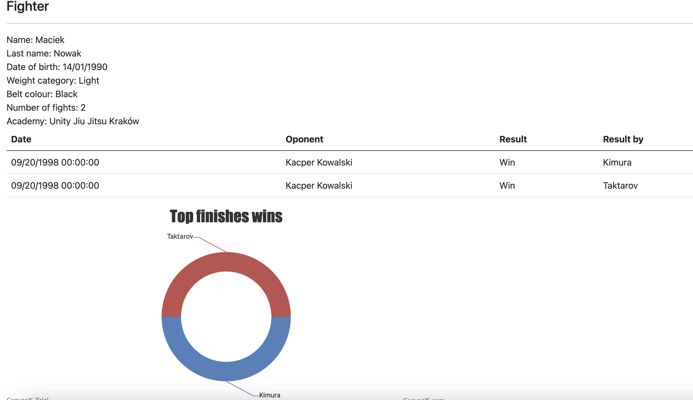

# Bjj
## _Manage brazilian jiu-jitsu fighters and fights database._
Bjj is a ASP.NET Core MVC CRUD application with amazing GUI which gives you opportunity to manage database of fighters in  ✨Magic ✨ way.
## Features
- Add, edit, remove fighter to database.
- Add, edit, remove fight to database.
- Add, edit, remove bjj academy to database.
- Add, edit, delete fight endings to the database.
- Generate detailed report of fighter.
  
## Tech
Bjj is built on top of:
- [ASP.NET Core MVC target framework net6.0]
- [SQLite] - database.

## Installation
1. Clone repository.
2. Open solution using Visual Studio or Rider.
3. Run Bjj project, everything should run automatically.
## License

MIT

**Free Software**